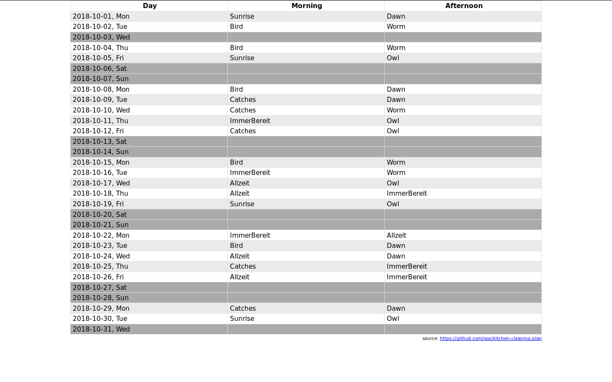

# Kitchen Cleaning Plan (with German holidays)

When printed it looks like this: [example-plan.pdf](example-plan.pdf)

Can be configured via URL parameters:

* `early`: People who would rather be on kitchen duty in the morning, comma separated
* `night`: People who would rather be on kitchen duty in the afternoon, comma separated
* `people`: People not having a preference, comma separated
* `date`: If not set, takes the current year/month. Can be specified explicitly in this format: `2018-12-24` (exact day does not matter)

You can bookmark and print your Kitchen Cleaning Plan!

## Examples

* One early bird, one night owl only: https://ooz.github.io/kitchen-cleaning-plan/?early=Bird&night=Owl
* Bunch of people not having preferences: https://ooz.github.io/kitchen-cleaning-plan/?people=Dunno,Dunsee,Dunhear,Dunspeak,Duncare,Someone
* Mixed bunch of people: https://ooz.github.io/kitchen-cleaning-plan/?early=Bird,Catches,Sunrise&night=Owl,Worm,Dawn&people=Allzeit,ImmerBereit
* Mixed bunch of people, plan for May 2018: https://ooz.github.io/kitchen-cleaning-plan/?early=Bird,Catches,Sunrise&night=Owl,Worm,Dawn&people=Allzeit,ImmerBereit&date=2018-05-23

## [Tests](https://ooz.github.io/kitchen-cleaning-plan/test.html)
